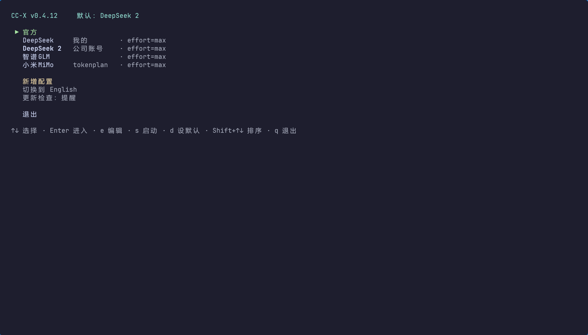
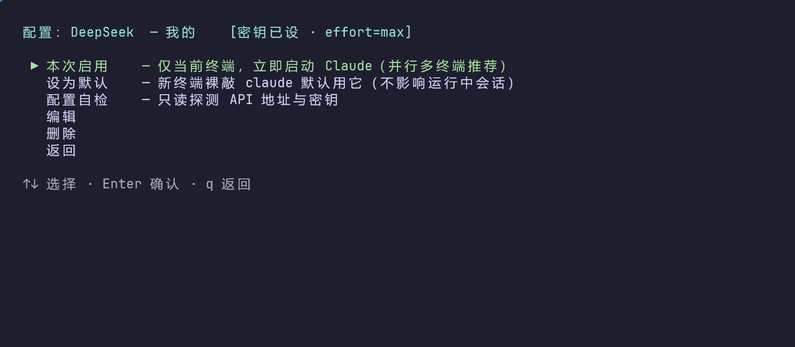
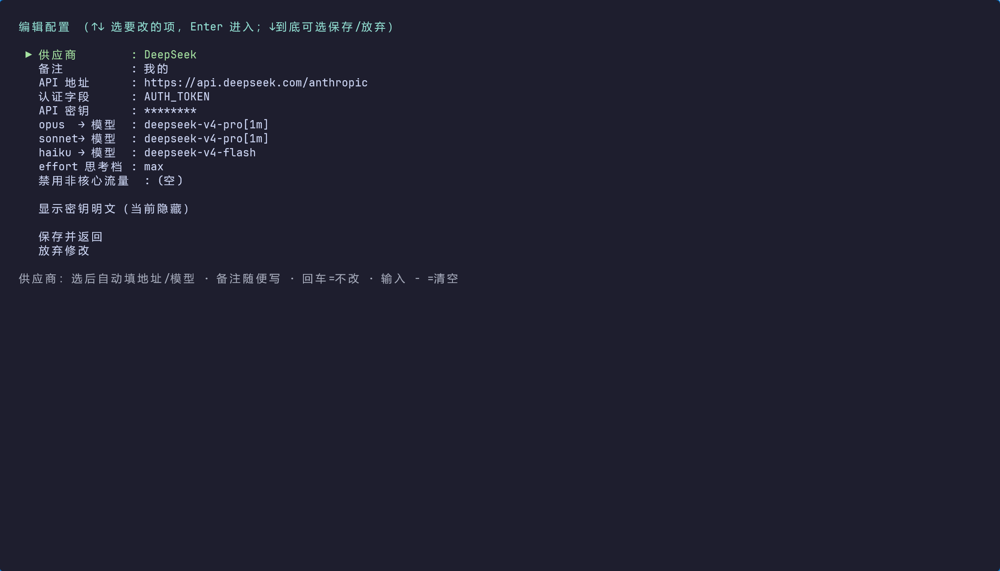

<h1 align="center">CC-X</h1>

<p align="center">
  <strong>一件事做好，不替你多做一步</strong>
</p>

<p align="center">
  <a href="https://github.com/becomeless/cc-x/releases/latest"></a>
  <a href="LICENSE"></a>
  <a href="https://github.com/becomeless/cc-x/releases/latest"></a>
  <a href="https://github.com/becomeless/cc-x/actions"></a>
</p>

<p align="center">
  <a href="README.md">🇨🇳 中文</a> · <a href="README.en.md">🇺🇸 English</a>
</p>

<p align="center">
  <a href="#安装">安装</a> · <a href="#60-秒上手">上手</a> · <a href="#两种模式核心概念">概念</a> · <a href="#配置说明">配置</a> · <a href="#faq">FAQ</a>
</p>

---

> `xx` — Claude Code 多 API 切换，一个命令搞定。

CC-X 只做一件事：切换 Claude Code 用哪个 API。切换只在**环境变量层**——不读写任何 Claude Code 配置文件，MCP、插件、hooks 碰都不碰。







---

## 安装

> 先装好 [Claude Code](https://claude.ai/code)（`claude` 在 PATH 中）。装完**新开一个终端**。

### Step 1 · 安装 CC-X

**Windows（推荐原生版）**

```powershell
irm https://github.com/becomeless/cc-x/releases/latest/download/install.ps1 | iex
```

安装器会自动选择用户级目录并写入用户 PATH，无需管理员权限，也无需手动配置。

**macOS / Linux（推荐原生版）**

```bash
curl -fsSL https://github.com/becomeless/cc-x/releases/latest/download/install.sh | sh
```

安装器会放到用户级命令目录；若该目录不在 PATH 中，会打印一行提示（Unix 版刻意不自动改 shell 配置）。

**npm（全平台，需 Node.js ≥ 18）**

```bash
npm install -g @cc-x/cc-x
```

> 推荐 **Go 原生版**——GitHub Release 提供轻量 `xx` / `xx.exe`，无需 Node.js，覆盖 Windows x64、macOS Intel / Apple Silicon、Linux x64 / arm64。npm 用户可装 `@cc-x/cc-x`（命令仍是 `xx`）。两版功能一致。

### Step 2 · 配置 API 密钥

```bash
xx   # 首次运行自动生成 4 个预设，选一个 → 编辑 → 填入你的 key
```

### Step 3 · 开始使用

```bash
xx DeepSeek -s     # 本次启用，立即启动 Claude
xx DeepSeek        # 设为默认，以后新终端自动生效
```

### 更新到新版本

更新就是**重新跑一遍安装命令**——安装器会下载最新版覆盖旧的，不用先卸载。跑完**新开一个终端**，`xx --version` 即为新版本。

- **Windows**：`irm https://github.com/becomeless/cc-x/releases/latest/download/install.ps1 | iex`
- **macOS / Linux**：`curl -fsSL https://github.com/becomeless/cc-x/releases/latest/download/install.sh | sh`
- **npm**：`npm i -g @cc-x/cc-x@latest`

> 把菜单里的「更新检查」开到「提醒」后，有新版时 CC-X 会在菜单顶部横幅提示，并直接给出上面对应平台的升级命令。

---

## 60 秒上手

首次运行 `xx` 会在 `~/.cc-mini/providers.json` 生成 4 个预设配置（官方 + DeepSeek + 智谱GLM + 小米MiMo），**密钥为空**。

1. `xx` → ↑↓ 选中要用的配置 → Enter → 「编辑」→「API 密钥」→ 填入你的 key
2. 配好后二选一：
   - **本次启用** — 即刻在当前终端启动 Claude（临时，多开互不干扰）
   - **设为默认** — 以后新终端裸敲 `claude` 就用它

```bash
xx                 # 打开菜单
xx DeepSeek        # 设为默认
xx DeepSeek -s     # 本次启用，立即启动 Claude（--session 同义）
xx -l              # 列出所有配置及状态（--list 同义）
xx --help          # 全部参数
```

---

## 两种模式（核心概念）

Claude 用哪个 API 由**环境变量**决定。CC-X 提供两种作用范围：

| | 本次启用 (`-s`) | 设为默认 |
|---|---|---|
| 机制 | 给当前进程设环境变量，启动 `claude` | 写入**用户环境变量** |
| 作用范围 | 仅当前终端，**关了就没** | 之后**新开**的终端默认用它 |
| 对正在跑的会话 | 零影响 | 零影响（进程启动时已定型） |
| 适合 | 多终端并行，各跑各的 API | 定好主力 API，不用老切 |

> 💡 **打个比方**：「本次启用」是临时换油——只管这一趟；「设为默认」是换了油箱里的油——以后新上车都用这个。

**并行示例**：开 4 个终端分别 `xx 官方 -s`、`xx DeepSeek -s`、`xx 智谱GLM -s`、`xx 小米MiMo -s`——四个 Claude 同时干活、各用各的 API、互不打架。

**为什么不用配置文件？** `settings.json` 全局共享，改它会波及正在跑的会话（典型症状：另一终端突然报 `cannot be parsed as a URL`）。环境变量天然进程隔离，避开了这个坑。

---

## 什么时候不该用 CC-X

- 你需要管理 MCP、hooks、插件、多 CLI → 用 [cc-switch](https://github.com/farion1231/cc-switch)
- 你只用官方 API，不切第三方 → 不需要 CC-X
- 你要自动迁移/备份配置 → 不在 CC-X 范围内

CC-X 的边界比功能更重要。它只做一件事：**切 API**。

---

## 设计哲学

> CC-X 的边界比功能更重要。

Claude Code 已经有自己的配置系统、MCP 生态和会话状态。CC-X 不想再造一个"上层控制台"——它只站在进程启动前那一小步：把 10 个受管环境变量准备好，然后让 Claude Code 自己工作。不写配置文件，不接管 MCP，不做后台常驻管理；能让用户显式选择，就不替用户自动决定。

欢迎 Issue / PR，但方向很明确：**让切换更稳、更清楚、更不打扰用户**，比堆更多管理能力更重要。任何会写 Claude Code 配置文件的改动都不会被接受——唯一例外是主菜单「一键免登录」：用户主动点击时把 `~/.claude.json` 顶层 `hasCompletedOnboarding` 写为 `true`（字节级最小修改，只动这一个字段）。

---

## 和 cc-switch 怎么选

cc-switch 是优秀的全能 GUI；CC-X 走相反的极简路线。

| | CC-X (`xx`) | cc-switch |
|---|---|---|
| 形态 | 终端命令（轻量） | 桌面 GUI（全能） |
| 职责 | 只切 API | API + MCP + 多 CLI + 提示词… |
| 改配置文件？ | **不碰**（纯环境变量） | 会重写 |
| 能弄丢 MCP？ | **不可能** | 有用户反馈被覆盖 |
| 多终端并行 | **原生支持**（进程隔离） | 全局切换，容易互扰 |

- → **CC-X**：命令行党、常多开终端、被切配置坑过、只想要「切 API」一件事
- → **cc-switch**：要 GUI、要一站式管 MCP 和多 CLI

---

## 配置说明

### 字段一览

| 字段 | 对应环境变量 | 说明 |
|---|---|---|
| API 地址 | `ANTHROPIC_BASE_URL` | 第三方接入点；官方留空=登录态 |
| 认证字段 | — | 密钥放 `AUTH_TOKEN`（默认）还是 `API_KEY`；**放错会 401** |
| API 密钥 | `ANTHROPIC_AUTH_TOKEN` 或 `ANTHROPIC_API_KEY` | 对应认证字段的值 |
| opus → 模型 | `ANTHROPIC_DEFAULT_OPUS_MODEL` | 四档模型映射；后台任务走 haiku 档，**必须填** |
| sonnet → 模型 | `ANTHROPIC_DEFAULT_SONNET_MODEL` | |
| haiku → 模型 | `ANTHROPIC_DEFAULT_HAIKU_MODEL` | |
| fable → 模型 | `ANTHROPIC_DEFAULT_FABLE_MODEL` | 最强档（如 Fable 5）；供应商没这档就留空 |
| 子代理 → 模型 | `CLAUDE_CODE_SUBAGENT_MODEL` | 子代理/agent teams 用模型；**留空=官方默认（继承主模型）**。想省钱可填 `haiku`（别名，跟随本配置的 haiku 档）或具体模型名 |
| effort 思考档 | `CLAUDE_CODE_EFFORT_LEVEL` | `low` ~ `max`；`auto`=模型默认；留空=不设。第三方不一定生效 |
| 禁用非核心流量 | `CLAUDE_CODE_DISABLE_NONESSENTIAL_TRAFFIC` | `1`=禁用 Claude Code 非核心流量；留空=不设。GLM 预置为 `1` |

> CC-X **刻意不设** `ANTHROPIC_MODEL`。在会话里用 `/model opus|sonnet|haiku|fable` 选档，映射表负责翻译成对应供应商的模型名。

### 认证字段：AUTH_TOKEN vs API_KEY

| 选项 | 实际请求头 | 谁用 |
|---|---|---|
| `AUTH_TOKEN`（默认） | `Authorization: Bearer <key>` | 绝大多数第三方中转 |
| `API_KEY` | `x-api-key: <key>` | 官方 API，及少数中转 |

### 预置配置

| 配置 | BASE_URL | OPUS / SONNET | HAIKU（含后台任务） | effort | 额外 env |
|---|---|---|---|---|---|
| 官方 | 留空=登录态 | — | — | — | — |
| DeepSeek | `https://api.deepseek.com/anthropic` | `deepseek-v4-pro` | `deepseek-v4-flash` | `max`（官方推荐） | — |
| 智谱GLM | `https://open.bigmodel.cn/api/anthropic` | `GLM-4.7` | `glm-4.5-air` | — | `CLAUDE_CODE_DISABLE_NONESSENTIAL_TRAFFIC=1` |
| 小米MiMo | `https://api.xiaomimimo.com/anthropic` | `mimo-v2.5-pro` | `mimo-v2.5-pro` | — | — |

> 模型名随各家更新而变，以供应商官方接入文档为准。小米有按量付费和 TokenPlan 两个地址，选供应商时会让你挑。
> 四个模型档位行（opus/sonnet/haiku/fable）编辑时可选「从模型列表选择」——从供应商 API 拉取实际可用模型，支持 1M 的模型（如 `deepseek-v4-pro`、`glm-5.2`、`mimo-v2.5-pro`）标 `[1M]` 并自动附 `[1m]` 后缀，无需手敲；失败回退手动输入。

### 进阶

- **多账号**：同一家建多份配置，名称自动追加「 2」「 3」…用**备注**区分，列表显示为「供应商 — 备注」。
- **自定义供应商**：`presets.json` 是供应商目录，加一个 JSON 条目就多一个供应商，无需改代码。可在 `~/.cc-mini/presets.json` 放自定义版覆盖随工具发布的版本。
- **第三方首次弹登录**：主菜单「一键免登录」把 `~/.claude.json` 的 `hasCompletedOnboarding` 写为 `true`（官方推荐的免登录方式，mimo 接入文档同款做法），下次启动 Claude Code 不再弹登录引导；不合法时拒绝写入并提示。这是 CC-X 写 Claude Code 配置文件的唯一例外，只动这一个字段。
- **更新检查**：主菜单可切「提醒」模式，新版本出现时菜单顶部黄字提示升级命令。每天最多查一次，不自动升级。

---

## 数据与文件

- **配置（含明文密钥，勿外传）**：`~/.cc-mini/providers.json`（也存界面语言 `lang`、更新检查 `update`）
- **供应商目录**：随工具发布的 `presets.json`；`~/.cc-mini/presets.json` 可覆盖
- **「设为默认」写的是用户环境变量**（不是 Claude 配置文件）：
  - Windows → 注册表 `HKCU\Environment` + 广播一次变更
  - Unix → shell 启动文件 `# >>> xx >>>` … `# <<< xx <<<` 标记块（幂等重写，按 `$SHELL` 选文件）
  - 语义一致：**只影响新终端**；切到「官方」会清除全部受管变量

CC-X 只动这 10 个「受管」环境变量，切换时清掉目标不用的：
`ANTHROPIC_BASE_URL`、`ANTHROPIC_AUTH_TOKEN`、`ANTHROPIC_API_KEY`、`ANTHROPIC_DEFAULT_OPUS_MODEL`、`ANTHROPIC_DEFAULT_SONNET_MODEL`、`ANTHROPIC_DEFAULT_HAIKU_MODEL`、`ANTHROPIC_DEFAULT_FABLE_MODEL`、`CLAUDE_CODE_SUBAGENT_MODEL`、`CLAUDE_CODE_EFFORT_LEVEL`、`CLAUDE_CODE_DISABLE_NONESSENTIAL_TRAFFIC`。

> 💡 需要改 `settings.json`？直接用 Claude Code 的 `/update-config` 说需求（如"允许 npm 命令"），比让外部工具改可靠。

---

## FAQ

**一个终端切了，影响另一个吗？** 不影响。「本次启用」进程级，「设为默认」只对新终端生效。

**设为默认了，当前终端敲 `claude` 还是旧的？** 正常——当前终端是旧环境，新开即可。

**报 `cannot be parsed as a URL`？** 某配置的 API 地址填了无效值，编辑改正或删除。

**第三方 effort 没效果？** effort 是 Claude 模型特性，第三方不一定支持。DeepSeek 推荐 `max`，其余留空。

**密钥安全吗？** 明文存本机用户目录，受账户权限保护。别把 `providers.json` 提交到仓库。

---

## 卸载

1. 先清环境变量：`xx` → 选「官方」→ 设为默认
2. 卸载本体：
   - Windows 原生版：
     ```powershell
     $s = irm https://github.com/becomeless/cc-x/releases/latest/download/install.ps1
     & ([scriptblock]::Create($s)) -Uninstall
     ```
     会删除安装文件，并自动清理对应的用户 PATH 条目。
   - macOS / Linux 原生版：
     ```bash
     curl -fsSL https://github.com/becomeless/cc-x/releases/latest/download/install.sh | sh -s -- --uninstall
     ```
   - npm：`npm uninstall -g @cc-x/cc-x`
3. 删数据：`rm -rf ~/.cc-mini`

---

## 许可

[MIT](LICENSE)
